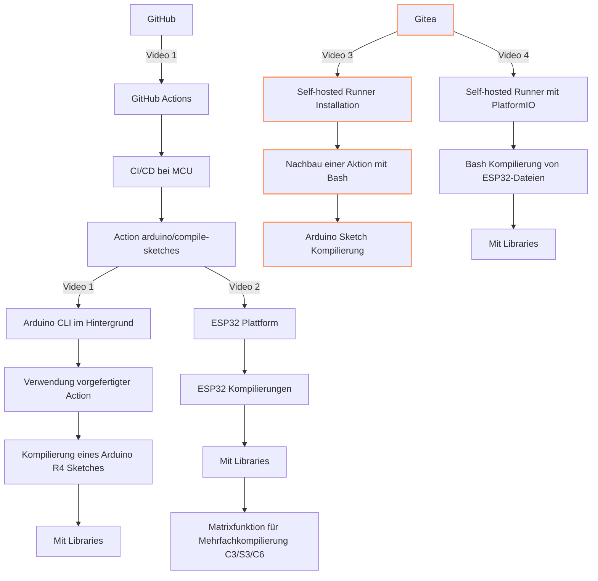

# Gitea Actions
Eine kurze Einführung mit Arduino und ESP32 Codes.
Im Vorfeld wurde ein Gitea Runner installiert.

- Gitea act runner Doku: https://docs.gitea.com/usage/actions/act-runner
- binary für config: https://dl.gitea.com/act_runner/0.2.10/

```bash
curl -L https://dl.gitea.com/act_runner/0.2.10/act_runner-0.2.10-linux-amd64 -o act_runner
chmod +x act_runner
./act_runner --version
./act_runner generate-config > config.yaml
```

docker-compose.yaml
```yaml
version: "3.8"
services:
  runner:
    container_name: gitearunner2
    image: gitea/act_runner:nightly
    environment:
      CONFIG_FILE: /config.yaml
      GITEA_INSTANCE_URL: "https://mygit.ipv64.net"
      GITEA_RUNNER_REGISTRATION_TOKEN: "whatanicetoken"
      GITEA_RUNNER_NAME: "runner2"
      GITEA_RUNNER_LABELS: "runner2"
    volumes:
      - ./config.yaml:/config.yaml
      - ./data:/data
      - /var/run/docker.sock:/var/run/docker.sock
```

## Videos
Playlist: https://www.youtube.com/playlist?list=PLluslK6uBf4tOir-zkFXTTtdfZk6BK0MW

## Alle Repos zur Serie
- https://github.com/pixelEDI/GitHubAction_ArduinoR4
- https://github.com/pixelEDI/GitHubAction_ESP32XIAO
- https://github.com/pixelEDI/GiteaAction_ArduinoR4
- https://github.com/pixelEDI/GIiteaAciton_pio_ESP32XIAO


